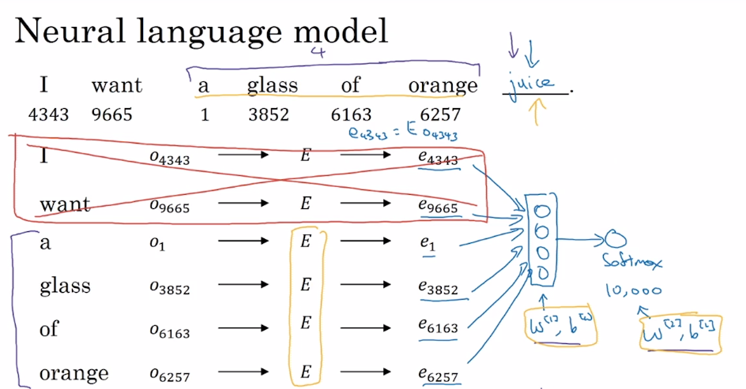
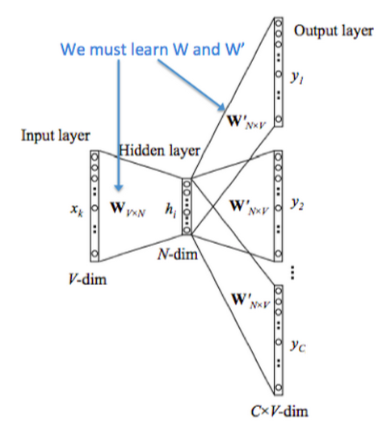
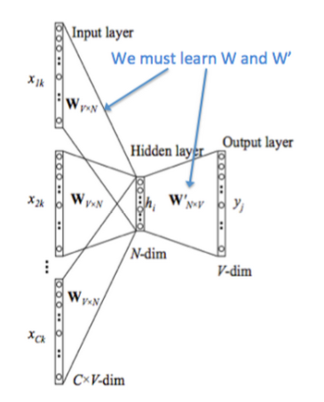
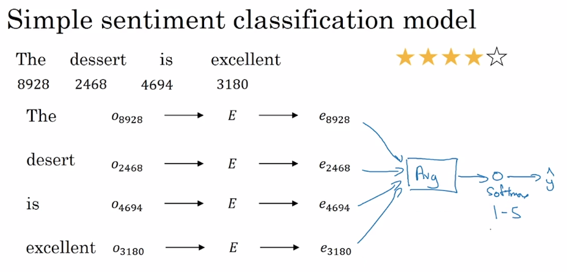
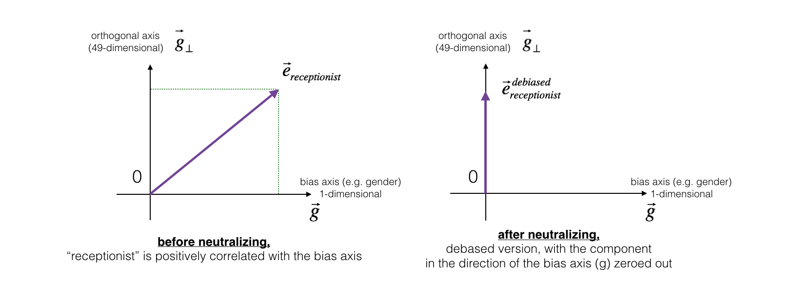
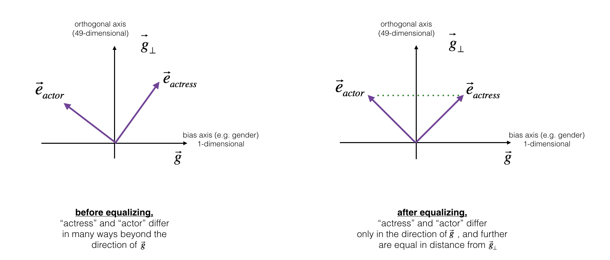

# Natural Language Processing & Word Embeddings

## 1.词嵌入

one-hot 向量将每个单词表示为完全独立的个体，不同词向量都是正交的，因此单词间的相似度无法体现。

换用特征化表示方法能够解决这一问题。我们可以通过用语义特征作为维度来表示一个词，因此语义相近的词，其词向量也相近。

将高维的词嵌入“嵌入”到一个二维空间里，就可以进行可视化。常用的一种可视化算法是 t-SNE 算法。在通过复杂而非线性的方法映射到二维空间后，每个词会根据语义和相关程度聚在一起。相关论文：[van der Maaten and Hinton., 2008. Visualizing Data using t-SNE](https://www.seas.harvard.edu/courses/cs281/papers/tsne.pdf)

**词嵌入(Word Embedding)** 是 NLP 中语言模型与表征学习技术的统称，概念上而言，它是指把一个维数为所有词的数量的高维空间（one-hot 形式表示的词）“嵌入”到一个维数低得多的连续向量空间中，每个单词或词组被映射为实数域上的向量。对大量词汇进行词嵌入后获得的词向量，可用于完成**命名实体识别(Named Entity Recognition)**等任务。

### 1.1.词嵌入与迁移学习

用词嵌入做迁移学习可以降低学习成本，提高效率。其步骤如下：

1. 从大量的文本集中学习词嵌入，或者下载网上开源的、预训练好的词嵌入模型；
2. 将这些词嵌入模型迁移到新的、只有少量标注训练集的任务中；
3. 可以选择是否微调词嵌入。当标记数据集不是很大时可以省下这一步。

### 1.2.词嵌入与类比推理

词嵌入可用于类比推理。例如，给定对应关系“男性（Man）”对“女性（Woman）”，想要类比出“国王（King）”对应的词汇。则可以有 $e\_{man} - e\_{woman} \approx e\_{king} - e\_? $ ，之后的目标就是找到词向量 $w$，来找到使相似度 $sim(e\_w, e\_{king} - e\_{man} + e\_{woman})$ 最大。

一个最常用的相似度计算函数是**余弦相似度（cosine similarity）**。公式为：

$$sim(u, v) = \frac{u^T v}{|| u ||\_2 || v ||\_2}$$

相关论文：[Mikolov et. al., 2013, Linguistic regularities in continuous space word representations](https://www.microsoft.com/en-us/research/wp-content/uploads/2016/02/rvecs.pdf)

## 2.嵌入矩阵

不同的词嵌入方法能够用不同的方式学习到一个**嵌入矩阵（Embedding Matrix）** $E$。将字典中位置为 $i$ 的词的 one-hot 向量表示为 $o\_i$，词嵌入后生成的词向量用 $e\_i$表示，则有：

$$E \cdot o\_i = e\_i$$

但在实际情况下一般不这么做。因为 one-hot 向量维度很高，且几乎所有元素都是 0，这样做的效率太低。因此，实践中直接用专门的函数查找矩阵 $E$ 的特定列。

## 3.学习词嵌入

### 3.1.神经概率语言模型

**神经概率语言模型（Neural Probabilistic Language Model）**构建了一个能够通过上下文来预测未知词的神经网络，在训练这个语言模型的同时学习词嵌入。

训练过程中，将语料库中的某些词作为目标词，以目标词的部分上下文作为输入，Softmax 输出的预测结果为目标词。嵌入矩阵 $E$ 和 $w$、$b$ 为需要通过训练得到的参数。这样，在得到嵌入矩阵后，就可以得到词嵌入后生成的词向量。

相关论文：[Bengio et. al., 2003, A neural probabilistic language model](http://www.jmlr.org/papers/volume3/bengio03a/bengio03a.pdf)

### 3.2.Word2Vec

**Word2Vec** 是一种简单高效的词嵌入学习算法，包括 2 种模型：

* **Skip-gram (SG)**：根据词预测目标上下文
* **Continuous Bag of Words (CBOW)**：根据上下文预测目标词

每种语言模型又包含**负采样（Negative Sampling）**和**分级的 Softmax（Hierarchical Softmax）**两种训练方法。

训练神经网络时候的隐藏层参数即是学习到的词嵌入。

相关论文：[Mikolov et. al., 2013. Efficient estimation of word representations in vector space.](https://arxiv.org/pdf/1301.3781.pdf)

#### 3.2.1.Skip-gram

从上图可以看到，从左到右是 One-hot 向量，乘以 center word 的矩阵 $W$ 于是找到词向量，乘以另一个 context word 的矩阵 $W'$ 得到对每个词语的“相似度”，对相似度取 Softmax 得到概率，与答案对比计算损失。

设某个词为 $c$，该词的一定词距内选取一些配对的目标上下文 $t$，则该网路仅有的一个 Softmax 单元输出条件概率：

$$p(t|c) = \frac{exp(\theta\_t^T e\_c)}{\sum^m\_{j=1}exp(\theta\_j^T e\_c)}$$

$\theta\_t$ 是一个与输出 $t$ 有关的参数，其中省略了用以纠正偏差的参数。损失函数仍选用交叉熵：

$$L(\hat y, y) = -\sum^m\_{i=1}y\_ilog\hat y\_i$$

在此 Softmax 分类中，每次计算条件概率时，需要对词典中所有词做求和操作，因此计算量很大。解决方案之一是使用一个**分级的 Softmax 分类器（Hierarchical Softmax Classifier）**，形如二叉树。在实践中，一般采用霍夫曼树（Huffman Tree）而非平衡二叉树，常用词在顶部。

如果在语料库中随机均匀采样得到选定的词 $c$，则 'the', 'of', 'a', 'and' 等出现频繁的词将影响到训练结果。因此，采用了一些策略来平衡选择。

#### 3.2.2.CBOW

CBOW 模型的工作方式与 Skip-gram 相反，通过采样上下文中的词来预测中间的词。

吴恩达老师没有深入去讲 CBOW。想要更深入了解的话，推荐资料： 

* [[NLP] 秒懂词向量Word2vec的本质](https://zhuanlan.zhihu.com/p/26306795)（中文，简明原理）
* [word2vec原理推导与代码分析-码农场](http://www.hankcs.com/nlp/word2vec.html)（中文，深入推导）
* [课程 cs224n 的 notes1](https://github.com/stanfordnlp/cs224n-winter17-notes/blob/master/notes1.pdf)（英文）

#### 3.2.3.负采样

为了解决 Softmax 计算较慢的问题，Word2Vec 的作者后续提出了**负采样（Negative Sampling）**模型。对于监督学习问题中的分类任务，在训练时同时需要正例和负例。在分级的 Softmax 中，负例放在二叉树的根节点上；而对于负采样，负例是随机采样得到的。

如上图所示，当输入的词为一对上下文-目标词时，标签设置为 1（这里的上下文也是一个词）。另外任意取 k 对非上下文-目标词作为负样本，标签设置为 0。对于小数据集，k 取 5~20 较为合适；而当有大量数据时，k 可以取 2~5。

改用多个 Sigmoid 输出上下文-目标词（c, t）为正样本的概率：

$$P(y=1 | c, t) = \sigma(\theta\_t^Te\_c)$$

其中，$\theta\_t$、$e\_c$ 分别代表目标词和上下文的词向量。

之前训练中每次要更新 n 维的多分类 Softmax 单元（n 为词典中词的数量）。现在每次只需要更新 k+1 维的二分类 Sigmoid 单元，计算量大大降低。

关于计算选择某个词作为负样本的概率，作者推荐采用以下公式（而非经验频率或均匀分布）：

$$p(w\_i) = \frac{f(w\_i)^{\frac{3}{4}}}{\sum^m\_{j=0}f(w\_j)^{\frac{3}{4}}}$$

其中，$f(w\_i)$ 代表语料库中单词 $w\_i$ 出现的频率。上述公式更加平滑，能够增加低频词的选取可能。

相关论文：[Mikolov et. al., 2013. Distributed representation of words and phrases and their compositionality](https://arxiv.org/pdf/1310.4546.pdf)

### 3.3.Glove

**GloVe（Global Vectors）**是另一种流行的词嵌入算法。Glove 模型基于语料库统计了词的**共现矩阵**$X$，$X$中的元素 $X\_{ij}$ 表示单词 $i$ 和单词 $j$ “为上下文-目标词”的次数。之后，用梯度下降法最小化以下损失函数：

$$J = \sum^N\_{i=1}\sum^N\_{j=1}f(X\_{ij})(\theta^t\_ie\_j + b\_i + b\_j - log(X\_{ij}))^2$$

其中，$\theta\_i$、$e\_j$是单词 $i$ 和单词 $j$ 的词向量；$b\_i$、$b\_j$；$f()$ 是一个用来避免 $X\_{ij}=0$时$log(X\_{ij})$为负无穷大、并在其他情况下调整权重的函数。$X\_{ij}=0$时，$f(X\_{ij}) = 0$。

“为上下文-目标词”可以代表两个词出现在同一个窗口。在这种情况下，$\theta\_i$ 和 $e\_j$ 是完全对称的。因此，在训练时可以一致地初始化二者，使用梯度下降法处理完以后取平均值作为二者共同的值。

相关论文：[Pennington st. al., 2014. Glove: Global Vectors for Word Representation](https://nlp.stanford.edu/pubs/glove.pdf)

最后，使用各种词嵌入算法学到的词向量实际上大多都超出了人类的理解范围，难以从某个值中看出与语义的相关程度。

## 4.情感分类

情感分类是指分析一段文本对某个对象的情感是正面的还是负面的，实际应用包括舆情分析、民意调查、产品意见调查等等。情感分类的问题之一是标记好的训练数据不足。但是有了词嵌入得到的词向量，中等规模的标记训练数据也能构建出一个效果不错的情感分类器。

如上图所示，用词嵌入方法获得嵌入矩阵 $E$ 后，计算出句中每个单词的词向量并取平均值，输入一个 Softmax 单元，输出预测结果。这种方法的优点是适用于任何长度的文本；缺点是没有考虑词的顺序，对于包含了多个正面评价词的负面评价，很容易预测到错误结果。

使用 RNN 能够实现一个效果更好的情感分类器：

## 5.词嵌入除偏

语料库中可能存在性别歧视、种族歧视、性取向歧视等非预期形式偏见（Bias），这种偏见会直接反映到通过词嵌入获得的词向量。例如，使用未除偏的词嵌入结果进行类比推理时，"Man" 对 "Computer Programmer" 可能得到 "Woman" 对 "Housemaker" 等带有性别偏见的结果。词嵌入除偏的方法有以下几种：

### 5.1.中和本身与性别无关词汇

对于“医生（doctor）”、“老师（teacher）”、“接待员（receptionist）”等本身与性别无关词汇，可以**中和（Neutralize）**其中的偏见。首先用“女性（woman）”的词向量减去“男性（man）”的词向量，得到的向量 $g=e\_{woman}−e\_{man}$ 就代表了“性别（gender）”。假设现有的词向量维数为 50，那么对某个词向量，将 50 维空间分成两个部分：与性别相关的方向 $g$ 和与 $g$ **正交**的其他 49 个维度 $g\_{\perp}$。如下左图：

而除偏的步骤，是将要除偏的词向量（左图中的 $e\_{receptionist}$）在向量 $g$ 方向上的值置为 0，变成右图所示的 $e^{debiased}\_{receptionist}$。

公式如下：

$$e^{bias\_component} = \frac{e*g}{||g||\_2^2} * g$$
$$e^{debiased} = e - e^{bias\_component}$$

### 5.2.均衡本身与性别有关词汇

对于“男演员（actor）”、“女演员（actress）”、“爷爷（grandfather）”等本身与性别有关词汇，中和“婴儿看护人（babysit）”中存在的性别偏见后，还是无法保证它到“女演员（actress）”与到“男演员（actor）”的距离相等。对这样一对性别有关的词，除偏的过程是**均衡（Equalization）**它们的性别属性。其核心思想是确保一对词（actor 和 actress）到 $g\_{\perp}$ 的距离相等。

公式：

$$ \mu = \frac{e\_{w1} + e\_{w2}}{2}$$ 

$$\mu\_{B} = \frac {\mu * bias\\\_axis}{||bias\\\_axis||\_2} + ||bias\\\_axis||\_2 *bias\\\_axis$$ 

$$\mu\_{\perp} = \mu - \mu\_{B}$$

$$e\_{w1B} = \sqrt{ |{1 - ||\mu_{\perp} ||^2\_2} |} * \frac{(e\_{\text{w1}} - \mu\_{\perp}) - \mu\_B} {|(e\_{w1} - \mu\_{\perp}) - \mu\_B)|}$$

$$e\_{w2B} = \sqrt{ |{1 - ||\mu\_{\perp} ||^2\_2} |} * \frac{(e\_{\text{w2}} - \mu\_{\perp}) - \mu\_B} {|(e\_{w2} - \mu\_{\perp}) - \mu\_B)|}$$

$$e\_1 = e\_{w1B} + \mu\_{\perp}$$
$$e\_2 = e\_{w2B} + \mu\_{\perp}$$

相关论文：[Bolukbasi et. al., 2016. Man is to computer programmer as woman is to homemaker? Debiasing word embeddings](https://arxiv.org/pdf/1607.06520.pdf)
